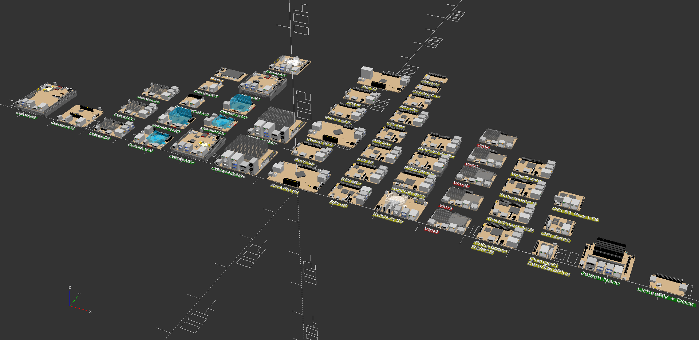

# SBC Model Framework


## Introduction

This project is a lightweight and dynamic framework for the generation of SBC and micro-controller models written in OpenSCAD.



### Current SBC: 61

## Using the Framework

Any of the models can be called by passing the requested SBC model in the form of sbc("model"). 
```
include <sbc_models.scad>
sbc("rpi5");
```

## Modifying and Adding Components
The framework is setup so that both SBC and components can be easily added or modified and the resulting models can be used regardless of the state of completion. The framework consists of three parts, the SBC data set (sbc_models.cfg), the main module(sbc_models.scad) and a library of components(sbc_library.scad).

sbc_models.cfg is an ASCII file that can be modified with any text editor. It contains a data set for the description of a given SBC.
The schema is as follows:
```
"model",pcbsize_x, pcbsize_y, pcbsize_z, pcbcorner_radius, topmax_component_z, bottommax_component_z
pcb_hole1_x, pcb_hole1_y, pcb1_hole_size, pcb_hole2_x, pcb_hole2_y, pcb2_hole_size
pcb_hole3_x, pcb_hole3_y, pcb3_hole_size, pcb_hole4_x, pcb_hole4_y, pcb4_hole_size
pcb_hole5_x, pcb_hole5_y, pcb5_hole_size, pcb_hole6_x, pcb_hole6_y, pcb6_hole_size
pcb_hole7_x, pcb_hole7_y, pcb7_hole_size, pcb_hole8_x, pcb_hole8_y, pcb8_hole_size
pcb_hole9_x, pcb_hole9_y, pcb9_hole_size, pcb_hole10_x, pcb_hole10_y, pcb10_hole_size
soc1size_x, soc1size_y, soc1size_z, soc1loc_x, soc1loc_y, soc1loc_z, soc1_rotation, "soc1_side",
soc2size_x, soc2size_y, soc2size_z, soc2loc_x, soc2loc_y, soc2loc_z, soc2_rotation, "soc2_side",
soc3size_x, soc3size_y, soc3size_z, soc3loc_x, soc3loc_y, soc3loc_z, soc3_rotation, "soc3_side",
soc4size_x, soc4size_y, soc4size_z, soc4loc_x, soc4loc_y, soc4loc_z, soc4_rotation, "soc4_side",
component_x, component_y, component_rotation, "component_side", "component_class","component_type"
```

Part of the schema has a fixed length and includes the SBC model, PCB xyz size, corner radius, top and bottom maximum component heights, up to 10 thru holes and up to 4 SOC. This part of the schema is the same length for all SBC definitions. The number of component entries is unlimited in quantity and I'll discuss that in a minute. I believe the basic PCB data is self explanatory. The physical dimensions(xyz) must be known in order to create it. The top and bottom maximum component Z height can be useful for designs using this library. PCB holes are limited to 10 defined by their xy center location and diameter. The number can be easily expanded if this becomes restrictive.

I choose to accommodate multiple SOC and not include them as a component for a couple of reasons. There are already SBC's that are specialized and include multiple processing units. I refer to them all in this framework as SOC but they could also be micro-controllers, neural-net processors, or dedicated communication processors on the PCB, to name a few. By defining them separately from components, additional information such as size and height can be included without burdening every component entry with this additional information. Four entries should be sufficient but it too can be easily expanded in the future without significant modification of the program. SOC entries can be rotated and also be placed on either side of the PCB. If a hole or SOC is not needed leave scalar values as zero and text entries empty.

The last entry in the schema is for components. A component is anything that is attached to the PCB. Any number of components from the library can be placed per SBC. The algorithm will automatically place as many or as few as defined. There are six values per component. The xy component location for the top of the PCB are measured from the lower left corner of PCB to the lower left corner of component or opening, with holes measured to the center. Bottom side components are measured from top left corner to top left corner of component when the PCB is rotated around the x axis. All measurements are in mm and as a general rule PCB orientation is with long side of the PCB along the x axis.

The rotation value does not rotate the component around the xy location. It is a reference to the direction that the component faces and whichever corner of the component is in the lower left after rotation, will assume the xy location specified for the component entry. This allows a uniform means to measure the placement of components regardless of their orientation on the PCB. The schema entry labeled component_side is the side of the PCB the component is to be placed on. So far we covered component_x, component_y, component_rotation and component_side. The last two entries are component_class and component_type. These entries together determine what component is placed. Each component class contains one or more component types. There are currently 17 component classes with corresponding component types.

## Component classes and types:


    
```
    memory  - "emmc","emmc_plug","sodimm_5.2","sodimm_9.2"
    switch -  "slide_4x9"
    button -  "momentary_6x6x9","momentary_6x6x4","momentary_6x6x4_90","momentary_4x2x1","momentary_7x3x3_90"
    plug -    "pwr2.5_5x7.5","pwr5.5_7.5x11.5","pwr5.5_10x10","rtc_micro","audio_micro","uart_micro","molex_4x1",
              "small_encl_satapwr"
    usb2 -    "micro","single_vertical_a","double_stacked_a","single_horizontal_a"
    usb3 -    "double_stacked_a","single_horizontal_a",
    network - "rj45_single",
    video -   "hdmi_a","hdmi_a_vertical","dp-hdmi_a","mipi_csi","mipi_dsi","hdmi_micro","dp_mini","hdmi_a_vertical"
    fan -     "micro","encl_pmw","encl_pmw_h"
    gpio -    "encl_header_12","encl_header_30","header_20","header_26","header_40"
    ic -      "ic_2.8x2.8","ic_3x3","ic_3.7x3.7","ic_4x4","ic_4.7x4.7","ic_5x5","ic_5.75x5.75","ic_6x6","ic_6.4x6.4",
              "ic_6.75x6.75","ic_7x7","ic_4.3x5.1","ic_5.4x5.3","ic_6.7x8.4","ic_9x9","ic_11x8","ic_13x8",
              "ic_13x9","ic_16x10"
    audio -   "out-in-spdif","jack_3.5"
    storage - "sdcard","sdcard_i","sata_header","sata_encl_header","m.2_header","m.2_stud","sata_encl_power",
              "sata_power_vrec","microsdcard"
    combo -   "rj45-usb2_double","rj45-usb3_double","double_stacked_usb3-usbc"
    jumper -  "header_2x1","header_3x1","header_3x2","header_5x1","header_6x1","header_7x1"
    misc -    "ir_1","bat_hold_1","led_3x1.5","lcd_2.2"
    heatsink -"hc4_oem","c4_oem","c2_oem","c1+_oem","xu4_oem","n1_oem","xu4q_oem","n2_oem","n2+_oem","m1_oem","h2_oem",
               "khadas_oem","khadas_fan_oem","radxa_oem"
    pcie -     "x4"
    jst_ph -   number of pins from 2-16
```
Simply put, new SBC are defined in sbc_model.cfg and new components are added to sbc_library.scad. To add an SBC, modify sbc_models.cfg by creating or copying of an existing SBC entry. Update the relative SBC data and components for the new SBC. When a component type needs to be added, simply add code that draws that component type in the class module the component belongs to, located in sbc_library.scad. There is no checking or validation of any kind so in reality any class can contain any component type. The names are simply the ones I choose to impose some structure that makes sense for my use of the library moving forward.

## Accuracy
In the past there was been no way of validating whether a SBC Model Framework model and it’s components were dimensionaly accurate in their size and placement other then trial and error. SBC Case Builder provides a much needed model validation tool to assure model accuracy thru the use of test cases. It works on the very simple premise that if the real SBC fits the test case then the virtual model is accurate or otherwise shows were corrections are needed. This will further increased the overall accuracy of models.

Some SBC in SBC Model Framework have not been validated or are missing component data and may produce one or more aspects of a case incorrectly. SBC status is noted in sbc.png, README.md and at the beginning of the SBC entry defined in sbc_models.cfg, all a part of SBC Model Framework. The color coded indicator of an SBC’s verification and completion as indicated in sbc.png is as follows:

GREEN = verified and complete
YELLOW = unverified, most likely usable and/or missing minor information
ORANGE = unverified, may be usable but missing component data
RED = unverified, not usable due to incomplete component data

The SBC that I do not own have been created using manufacturer supplied mechanical drawings. Some of the drawings are missing information or have errors that effect all or part of the drawings and subsequent SBC models. If you own an SBC that is not represented or verified in SBC Model Framework, please consider adding it or helping to verify existing SBC data. An SBC can be verified to be accurate if a printed shell case from SBC Case Builder fits. Any misalignment is corrected in the SBC Model Framework model data(sbc_models.cfg).  PR's or other means of communication with corrections are much appreciated and needed to work towards 100% SBC model verification.  Please contribute if you can.  Got a dead SBC, contribute it so I can check and verify it's model with a SBC Case Builder test case.
```
GREEN = verified to be correct using SBC Case Builder.
YELLOW = unverified, mostlikely usable and/or missing minor information.
ORANGE = unverified, may be usable but missing component data.
RED = unverified, not usable due to incomplete component data.
```

### Hardkernel Odroid: 20

c1+, c2, c4, xu4, xu4q, mc1, hc1, hc4, m1, m1_noheatsink, n1, n2, n2+, n2+_noheatsink, n2l, n2q, n2+, h2/h2+, h3/h3+ - GREEN, verified.

show2 - ORANGE, unverified, unknown status.


### Nividia: 1

jetsonnano - GREEN, verified.


### Pine64: 6

All created from mechanical drawings except rockpro64 which was contributed. The SOC data is missing for many of these SBC.

rock64 - YELLOW, unverified mostlikely usable and/or missing minor information.

rockpro64 - YELLOW, unverified mostlikely usable and/or missing minor information.

quartz64a - YELLOW, unverified mostlikely usable and/or missing minor information.

quartz64b - YELLOW, unverified mostlikely usable and/or missing minor information.

h64b - YELLOW, unverified mostlikely usable and/or missing minor information.

star64 - yellow, unverified mostlikely usable and/or missing minor information.

a64 - red, unverified, not usable due to incomplete component data.


### Raspberry Pi: 10

All created from mechanical drawings except rpi3b+ which was contributed. The SOC data is missing for these SBC.

rpizero/rpizerow - YELLOW, unverified mostlikely usable and/or missing minor information.

rpizero2w - YELLOW, unverified mostlikely usable and/or missing minor information.

rpi1a+ - YELLOW, unverified mostlikely usable and/or missing minor information.

rpi1b+ - YELLOW, unverified mostlikely usable and/or missing minor information.

rpi3a+ - YELLOW, unverified mostlikely usable and/or missing minor information.

rpi3b - YELLOW, unverified mostlikely usable and/or missing minor information.

rpi3b+ - YELLOW, unverified mostlikely usable and/or missing minor information.

rpi4b - YELLOW, unverified mostlikely usable and/or missing minor information.

rpi5, rpi5_noheatsink - green, verified.


### Radxa: 5

Created from mechanical drawings, the SOC data is missing for these SBC.

rock4b+ - YELLOW, unverified mostlikely usable and/or missing minor information.

rock4c - YELLOW, unverified mostlikely usable and/or missing minor information.

rock4c+ - YELLOW, unverified mostlikely usable and/or missing minor information.

rock5b-v1.3 - YELLOW, unverified mostlikely usable and/or missing minor information.

rock5b-v1.42 - GREEN, verified.

rock5bq-v1.42 - GREEN, verified.


### Khadas: 5

Created from mechanical drawings, the height information is not correct for these SBC.
The through RJ-45 component is not modeled correctly.

vim1 - RED, unverified, not usable due to incomplete component data.

vim2 - RED, unverified, not usable due to incomplete component data.

vim3l - RED, unverified, not usable due to incomplete component data.

vim3 - RED, unverified, not usable due to incomplete component data.

vim4 - RED, unverified, not usable due to incomplete component data.


### Asus: 6

tinkerboard - YELLOW, unverified mostlikely usable and/or missing minor information.

tinkerboard-s - YELLOW, unverified mostlikely usable and/or missing minor information.

tinkerboard-2/2s - YELLOW, unverified mostlikely usable and/or missing minor information.

tinkerboard-r2/r2s - YELLOW, unverified mostlikely usable and/or missing minor information.


### OrangePi: 6

opi5 - YELLOW, unverified mostlikely usable and/or missing minor information.

opizero/opizeroplus - YELLOW, unverified mostlikely usable and/or missing minor information.

opizero2 - YELLOW, unverified mostlikely usable and/or missing minor information.

opir1plus_lts - YELLOW, unverified mostlikely usable and/or missing minor information.

opir1 - GREEN, verified to be correct using SBC Case Builder.


### StarFive: 1

visonfive2 - GREEN, verified to be correct using SBC Case Builder.


### Sipeed: 1

licheerv+dock - GREEN, verified to be correct using SBC Case Builder.


### Digital Loggers, Inc.: 1

atomicpi - RED, unverified, not usable due to incomplete component data.


### RAK WisBlock: 1

rak19007 - RED, unverified, not usable due to incomplete component data.


License: GPLv3.


### Notes

  More information can be found at this [Hard Kernel forum thread](https://forum.odroid.com/viewtopic.php?f=53&t=33823)

