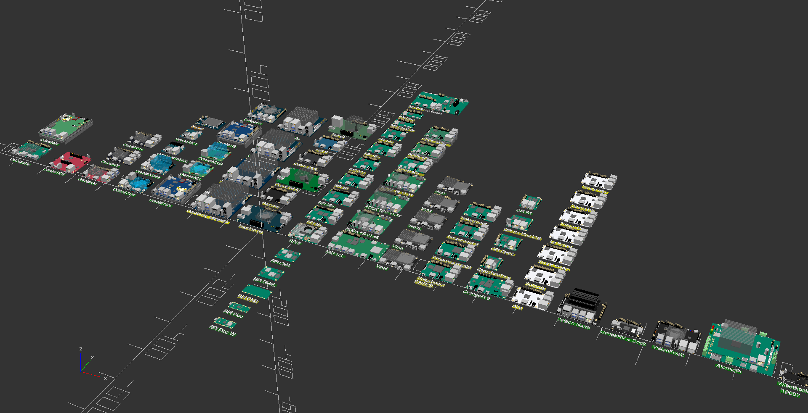

# SBC Model Framework

## Introduction

This project is a lightweight and dynamic framework for the generation of SBC and micro-controller models written in OpenSCAD.



SBC Model Framework provides 3D models of SBC, MCU, Compute Modules and Carrier Boards.  In addition, the framework allows for the automatic generation of IO mask sets to use for creating corresponding device openings.  This includes support for multiple masks for individual components that can be altered by shape and projection to cover a wide range of needs. Technical meta-data is also implemented to store device characteristics for reference and design purposes.


### Current Library

```
                  SBC:  83
       Carrier Boards:   4
      Compute Modules:   9
    Micro Controllers:   9
Standard Motherboards:  14
           Custom PCB:   1
        Total Devices: 117
```

## Using SBC Model Framework

Any of the models can be called by passing the requested SBC model in the form of sbc("model"). Command line options allow for the control of the SBC's heatsink and mask, GPIO and mask, UART mask and component masks. The heatsink fan mask size can be changed to allow for the use of different fan sizes from 30mm-92mm.

```
include <sbc_models.scad>
sbc("rpi5");
```

```
USAGE: sbc(model, enableheatsink = "default", fansize = 0, enablegpio =  "default", enableuart =  "default", enablemask = false)

         model = "c1+","c2","c4","hc4","c5","xu4","xu4q","mc1","hc1","n1","n2","n2+","n2l","n2lq",
                 "m1","m1s","m2","h2","h2+","h3","h3+","h4","h4+","h4_ultra","show2",
                 "rpipicow","rpipicow","rpizero","rpizero2w","rpi1a+","rpi1b+","rpi3a+","rpi3b","rpi3b+","rpi4b","rpi5",
                 "rpicm1","rpicm3","rpicm3l","rpicm3+","rpicm4","rpicm4l","rpicm1","rpicm4+ioboard",
                 "a64","a64lts","rock64","rockpro64","quartz64a","quartz64b","h64b","star64","soedge_rk1808","soedge_a-baseboard"
                 "rock4a","rock4a+","rock4b","rock4b+","rock4c","rock4c+","rock5b-v1.3","rock5b","rock5b+","nio12l"
                 "vim1","vim2","vim3l","vim3","vim4",
                 "tinkerboard","tinkerboard-s","tinkerboard-2","tinkerboard-2s","tinkerboard-r2","tinkerboard-r2s",
                 "opi5","opizero","opizero2","opir1plus_lts","opir1", "opi5max","opi3b-v2.1",
                 "lepotato","sweetpotato","tirtium-h2+","tritium-h3","tritium-h5","solitude","alta"
                 "jetsonnano",
                 "bpif3",
                 "licheerv+dock",
                 "visionfive2",
                 "atomicpi",
                 "milk-v_duos",
                 "rak19007",
                 "cnano-avr128da48",
                 "nodemcu-32s", "cs-solarmeter",
                 "feather-m0_express", "feather-m0_wifi", "feather-m4_express"
                 "ssi-eeb", "ssi-ceb", "atx", "micro-atx", "dtx", "flex-atx", "mini-dtx", "mini-itx", "mini-itx_thin", 
                 "mini-stx", "mini-stx_thin", "nano-itx", "nuc", "pico-itx"

enableheatsink = "disable", "off", "default", "none", "open", "fan_open", "fan_1", "fan_2", "fan_hex", 
                 "vent", "vent_hex_5mm", "vent_hex_8mm", "custom"
       fansize = 0, 25, 30, 40, 50, 60, 70, 80, 92
    enablegpio = "disable", "off", "default", "none", "open", "block", "knockout", "vent" 
    enableuart = "default", "none", "open", "knockout"
    enablemask = true or false
```

There are 13 different command line options for the heatsink:

```
"disable" - turns off the heatsink model and mask
"off" - heatsink model is off, mask is on and default will be used when called.
"default" - heatsink model is on and uses the mask setting stored in sbc_models.cfg
"none" - heatsink model is on and mask is off.
"open", "fan_open", "fan_1", "fan_2", "fan_hex",
"vent", "vent_hex_5mm", "vent_hex_8mm", "custom" - to use specific mask
```

There are 8 different command line options for the GPIO:

```
"disable" - turns off the GPIO model and mask
"off" - GPIO model is off, mask is on and default will be used when called.
"default" - GPIO model is on and uses the mask setting stored in sbc_models.cfg
"none" - GPIO model is on and mask is off.
"open", "block", "knockout", "vent" - to use specific mask
```

There are 4 different command line options for the UART:

```
"default" - UART model is on and uses the mask setting stored in sbc_models.cfg
"none" - UART model is on and mask is off.
"open", "knockout" - to use specific mask
```

To call the 3D model or mask set

```
enablemask - false produces 3D model, true produces IO mask set
```

## SBC Model and Component Viewer

The sbc_models_viewer has a Customizer UI and can be used to examine individual devices in the library, all of them at once or the component classes and types.  It has the follow features:

- Display SBC, MCU and CM Models
- Device Technical Information Access
- 5-way 2D Sections for DXF export
  - PCB shape with PCB and GPIO Holes
  - Rear, Front, Left and Right Sides
- Console text list of PCB size and PCB hole locations and uses
- 3D Reference Manual with Component Classes, Types and model.

The information display requires a monospaced font for proper presentation.  Several of the common open-source monospaced fonts are included in the pickbox under the Customizer UI.  Verify what fonts are installed and recognized by the system using the menu selection **Help->Font List**.  Any installed monospaced font can be used by updating the *text_font* variable on line 36.


## Adding Devices

The framework is setup so that SBC, MCU and CM can be easily added or modified and the resulting models can be used regardless of the state of completion. The framework consists of three parts, the SBC data set (sbc_models.cfg), the main module(sbc_models.scad) and a library of components(sbc_library.scad).

All devices are described in sbc_models.cfg, an ASCII file that can be modified with any text editor. It contains commands for the description of a given SBC model using the following schema:

class, type, pcbid, loc_x, loc_y, loc_z, face, [rotation], [size_x, size_y, size_z], [data_1, data_2...], [mask]

A device is defined by using the commands *pcb* and *pcbhole* to define the PCB shape and hole locations.  Each PCB in a device description is uniquely identified by the *pcb_id*.  All commands that share the same pcb_id are associated to that PCB which allows for multi-PCB devices such as an SBC that is comprised of two PCB or a compute module and it's carrier board. Each device entry in the file sbc_models.cfg must have as it's first entries:

- *device_model* - unique key identifying device
- *pcb_info[]* - device information array
- *pcb* - class entry for the first PCB in the device

SBC Model Viewer can be used to view the new pcb by adding its unique name to the array on line 30 of sbc_model_viewer.scad which is used to populate the pick box of all known devices. Restarting the application since the OpenSCAD Customizer does not support dynamic changes to the user interface.
  
The remainder of the entries describing a device can be in any order.

```
["device_model",[pcb_info],
                                   r                                                   s
                                   o                                                   e
                  p                t     s  s  s      d  d  d  d  d  d              l  t    m
   c              c l l l          a     i  i  i      a  a  a  a  a  a              e       s
   l       t      b o o o   f      t     z  z  z      t  t  t  t  t  t         m    n  b    t
   a       y        c c c   a      i     e  e  e      a  a  a  a  a  a         a    g  a    y
   s       p      i         c      o                                           s    t  c    l
   s,      e,     d,x,y,z,  e,     n,   [x, y, z],   [1, 2, 3, 4, 5, 6]. . ., [k,   h, k,   e]
"pcb","rectangle",0,0,0,0,"top",[0,0,0],[85,56,1],[3.5,"#1e2028",0,0,0,18,6],[false,10,2,"default"]

"pcbhole","round",0,3.5,3.5,0,"top",[0,0,0],[3,0,0],["solid","#fee5a6","rear",5,"left_rear"],[false,10,2,"default"],
"pcbhole","round",0,3.5,52.5,0,"top",[0,0,0],[3,0,0],["solid","#fee5a6","front",5,"left_front"],[false,10,2,"default"],
"pcbhole","round",0,61.5,3.5,0,"top",[0,0,0],[3,0,0],["solid","#fee5a6","rear",5,"right_rear"],[false,10,2,"default"],
"pcbhole","round",0,61.5,52.5,0,"top",[0,0,0],[3,0,0],["solid","#fee5a6","front",5,"right_front"],[false,10,2,"default"],

"pcbsoc","flat",0,23,23,0,"top",[0,0,0],[13,13,1.25],[1],[false,10,2,"default"],                            
...
]
```

The next step is to populate the SBC model's configuration entry with it's components.  There are approximately 35 Classes of components with many having several types or parametric parameters to produce different sizes, genders or other features. The asterisk in the Component Classes and Types table below indicate use classes that have one or more masks for openings - component types that are parametric have parametric masks.
```
"power","pwr2.5_5x7.5",0,46.5,0,0,"top",[0,0,0],[0,0,0],[0],[true,10,2,"default"],
"video","hdmi_a",0,24.5,-1,0,"top",[0,0,0],[0,0,0],[0],[true,10,2,"default"],
"network","rj45_single",0,65,2.25,0,"top",[0,0,270],[0,0,0],[0],[true,10,2,"default"],
```

### Component Classes and Types:

```
    antenna  - "ipex"
 *  audio    - "out-in-spdif", "jack_3.5", "audio_micro", "mic_round"
    b2b      - "df40"(parametric)
    battery  - "bat_hold_1", "rtc_micro"
 *  button   - "momentary_6x6x9", "momentary_6x6x4", "momentary_6x6x4_90", "momentary_4x2x1_90",
               "momentary_4x2x1", "momentary_7x3x3_90", "momentary_4.5x3.5x2.5_90"
    cm       - "cm1","cm3","cm3l","cm4","cm4l","jetsonnano"
 *  db       - "db9"
 *  discrete - "ir_1", "ir_dual", "capacitor"(parametric), "led"(parametric)
 *  display  - "lcd_2.2"
    fan      - "fan_micro","encl_pmw","encl_pmw_h"
 *  fpc      - "fh19"(parametric), "fh12"(parametric)
 *  gpio     - "encl_header_12", "encl_header_30", "header_40", "header_26", "header_20"
    header   - "open"(parametric)
 *  heatsink - "40mm_active_10", "40mm_passive_10", "40mm_passive_25", "32mm_passive_10",
               "c1+_oem", "c2_oem", "c4_oem", "hc4_oem", "xu4_oem", "xu4q_oem", "n1_oem", "n2l_oem", "n2lq_oem"
               "n2_oem", "n2+_oem", "m1_oem", "m1s_oem", "h2_oem", "h3_oem",
               "atomicpi", "khadas_oem", "khadas_fan_oem", "radxa_oem", "rpi5_oem", "stub"
               "pine64_active_10", "pine64_passive_20", "pine64_passive_30"
    ic       - "generic"(parametric)
    jst      - "xh", "ph", "zh", "sh", "pa" (all parametric)
 *  memory   - "emmc", "emmc_plug", "emmc_plug_double", "sodimm_5.2", "sodimm_9.2"
    molex    - "7478"(parametric),"5046"(parametric)
 *  network  - "rj45_single", "rj45_single_short", "rj45_reverse_single", "rj45_low_profile1",
               "rj45_low_profile2", "rj45_double_stacked", "rj45-usb2_double", "rj45-usb3_double"
    pcb      - "round", "slot", "rectangle", "polygon", "dxf", "cm1", "cm3", "cm4"
    pcbhole  - "round"
    pcbadd   - "round", "slot", "rectangle", "polygon", "dxf"
    pcbsub   - "round", "slot", "rectangle", "polygon", "dxf"
    pcbsoc   - "flat"(parametric), "raised"(parametric), "mid-raised", "rk3399", "rk3588"
    pcie     - "x1","x4"
    pillar   - "hex"(parametric), "round"(parametric)
 *  power    - "pwr2.5_5x7.5", "pwr5.5_7.5x11.5", "pwr5.5_10x10", "pwr5.5_9.5x7", "pj-202ah", "molex_4x1", "small_encl_satapwr"
    smd      - "led"(parametric)
 *  storage  - "microsdcard", "microsdcard2", "microsdcard3", "microsdcard3_i", "sata_header",
               "sata_power_vrec", "sata_encl_power", "m.2_header", "m.2_stud"
 *  switch   - "slide_4x9", "slide_7x3.5x1"
 *  terminal - "screw", "barrier"(parametric)
 *  uart     - ""molex_5267", "molex_5268" 
 *  usb2     - "micro", "single_horizontal_a", "single_vertical_a", "double_stacked_a", "single_b"
 *  usb3     - "single_horizontal_a", "single_vertical_a", "double_stacked_a", "double_stacked_usb3-usbc","double_stacked_usb3-usb2"
 *  usbc     - "single_horizontal", "single_vertical"
 *  video    - "hdmi_a", "hdmi_a_vertical", "dp-hdmi_a", "hdmi_micro", "hdmi_mini"
               "dp_mini", "mipi_csi", "mipi_dsi"
```

### Component Entries
The first eight data entries are used by all components and describe the Class, Type, XYZ Location, PCB Side and Rotation for component placement.  The size[] and data[] arrays are used by some but not all components and their specific uses for each Class-Type can be found in the Class and Type Reference section below.

### Component Mask
A Component's mask for using I/O openings is set in the mask array through the following variables:
```
mask[0] = enable component mask (true, false)
mask[1] = length in mm
mask[2] = set back in mm
mask[3] = mstyle ("default")
```
The first mask array entry enables or disables that individual components mask.  If it is set to false all mask generation will be overridden.  The second mask variable length, sets the distance the mask will be projected to create an opening.  The third variable determines the setback.  Image a HDMI-A component that overhangs the PCB by 2mm.  If the mask opening starts at the face of the connector, there might not be an opening created because the face of the connector is beyond the wall.  The setback addresses this by pulling the mask backwards so an opening is created.  For the GPIO class only, the setback raises and lowers the opening instead of adjusting the setback.  The last entry in the mask array determines which mask to use if more then one is available.  All entries should indicate the *"default"* mask unless a specific mask is needed.  Some components, like heatsinks and GPIO, have many masks associated with them.

### Multi-PCB Devices
Multi-PCB devices are handled the same way as any other device, each PCB having a unique *pcb_id* that all it's components will share. The *pcb_id* zero will be the first PCB for all devices in the library and must be the first entry in the devices components.

## Class and Type Reference Manual

### antenna

```
 CLASS NAME: antenna
DESCRIPTION: creates antenna components.
      USAGE: antenna, type, pcb_id, loc_x, loc_y, loc_z, side, rotation[], size[], data[], mask[]

                      type = "ipex"
                    pcb_id = parent PCB
                     loc_x = x location placement
                     loc_y = y location placement
                     loc_z = z location placement
                      side = "top", "bottom"
                rotation[] = object rotation
                   mask[0] = component mask true, false
                   mask[1] = length
                   mask[2] = set back
                   mask[3] = mstyle "default"
```

### audio

```
 CLASS NAME: audio
DESCRIPTION: creates audio components.
      USAGE: audio, type, pcb_id, loc_x, loc_y, loc_z, side, rotation[], size[], data[], mask[]

                    type = "audio_micro"
                  pcb_id = parent PCB
                   loc_x = x location placement
                   loc_y = y location placement
                   loc_z = z location placement
                    side = "top", "bottom"
              rotation[] = object rotation
                 mask[0] = component mask true, false
                 mask[1] = length
                 mask[2] = set back
                 mask[3] = mstyle "default"

                    type = "jack_3.5"
                  pcb_id = parent PCB
                   loc_x = x location placement
                   loc_y = y location placement
                   loc_z = z location placement
                    side = "top", "bottom"
              rotation[] = object rotation
                 size[0] = body size_x
                 size[1] = body size_y
                 size[2] = body size_z
                 data[0] = neck diameter
                 data[1] = z adjustment
                 mask[0] = component mask true, false
                 mask[1] = length
                 mask[2] = set back
                 mask[3] = mstyle "default"

                    type = "mic_round"
                  pcb_id = parent PCB
                   loc_x = x location placement
                   loc_y = y location placement
                   loc_z = z location placement
                    side = "top", "bottom"
              rotation[] = object rotation
                 size[0] = body diameter
                 size[2] = body height
                 mask[0] = component mask true, false
                 mask[1] = length
                 mask[2] = set back
                 mask[3] = mstyle "default"

                    type = "out-in-spdif"
                  pcb_id = parent PCB
                   loc_x = x location placement
                   loc_y = y location placement
                   loc_z = z location placement
                    side = "top", "bottom"
              rotation[] = object rotation
                 mask[0] = component mask true, false
                 mask[1] = length
                 mask[2] = set back
                 mask[3] = mstyle "default"
```
### b2b
```
 CLASS NAME: b2b
DESCRIPTION: creates b2b headers in size, pitch and stacking height.
      USAGE: b2b, type, pcb_id, loc_x, loc_y, loc_z, side, rotation[], size[], data[], mask[]
                    
                  type = "df40"
                pcb_id = parent PCB
                 loc_x = x location placement
                 loc_y = y location placement
                 loc_z = z location placement
                  side = "top", "bottom"
            rotation[] = object rotation
               size[0] = #pins
               size[2] = stacking height (1.5, 2, 2.5, 3, 3.5, 4)
               data[0] = "default"
               data[1] = body color
               data[2] = "male", "female"

```
### battery
```
 CLASS NAME: battery
DESCRIPTION: creates batteries and support components.
      USAGE: battery, type, pcb_id, loc_x, loc_y, loc_z, side, rotation[], size[], data[], mask[]

                      type = "bat_hold_1", "rtc_micro"
                    pcb_id = parent PCB
                     loc_x = x location placement
                     loc_y = y location placement
                     loc_z = z location placement
                      side = "top", "bottom"
                rotation[] = object rotation
                   mask[0] = true enables component mask
                   mask[1] = mask length
                   mask[2] = mask setback
                   mask[3] = mstyle "default"
```
### button
```
 CLASS NAME: button
DESCRIPTION: creates buttons
      USAGE: buttons, type, pcb_id, loc_x, loc_y, loc_z, side, rotation[], size[], data[], mask[]

                      type = "momentary_6x6x9", "momentary_6x6x4", "momentary_6x6x4_90", "momentary_4x2x1_90",
                             "momentary_4x2x1", "momentary_7x3x3_90", "momentary_4.5x3.5x2.5_90",
                             "momentary_4.5x4.5x4.5", "momentary_4.5x3.5x2.5_90"
                    pcb_id = parent PCB
                     loc_x = x location placement
                     loc_y = y location placement
                     loc_z = z location placement
                      side = "top", "bottom"
                rotation[] = object rotation
                   mask[0] = true enables component mask
                   mask[1] = mask length
                   mask[2] = mask setback
                   mask[3] = mstyle "default"
```
### cm
```
 CLASS NAME: cm
DESCRIPTION: creates compute modules as library components
      USAGE: cm, type, pcb_id, loc_x, loc_y, loc_z, side, rotation[], size[], data[], mask[]

                 type = "cm1","cm3","cm3l","cm4s","cm4","cm4l","jetsonnano"
               pcb_id = parent PCB
                loc_x = x location placement
                loc_y = y location placement
                loc_z = z location placement
                 side = "top", "bottom"
           rotation[] = object rotation
              data[0] = fan size
              data[1] = cm pcb color
              mask[0] = true enables component mask
              mask[1] = mask length
              mask[2] = mask setback
              mask[3] = mstyle "default"
```
### cm_holder
```
 CLASS NAME: cm_holder
DESCRIPTION: creates compute module holder
      USAGE: cm_holder, type, pcb_id, loc_x, loc_y, loc_z, side, rotation[], size[], data[], mask[]

                        type = "jetsonnano","cm1","cm3","cm3l","cm4"
                      pcb_id = parent PCB
                       loc_x = x location placement
                       loc_y = y location placement
                       loc_z = z location placement
                        side = "top", "bottom"
                  rotation[] = object rotation
                     mask[0] = true enables component mask
                     mask[1] = mask length
                     mask[2] = mask setback
                     mask[3] = mstyle "default"
```
### db
```
 CLASS NAME: db
DESCRIPTION: creates dsub connectors
      USAGE: display, type, pcb_id, loc_x, loc_y, loc_z, side, rotation[], size[], data[], mask[]

                      type = "db9"
                    pcb_id = parent PCB
                     loc_x = x location placement
                     loc_y = y location placement
                     loc_z = z location placement
                      side = "top", "bottom"
                rotation[] = object rotation
                   data[0] = "male","female"
                   mask[0] = component mask true, false
                   mask[1] = mask length
                   mask[2] = mask setback
                   mask[3] = mstyle "default"

```
### discrete
```
 CLASS NAME: discrete
DESCRIPTION: creates discrete components
      USAGE: discrete, type, pcb_id, loc_x, loc_y, loc_z, side, rotation[], size[], data[], mask[]

                       type = "ir_dual",
                     pcb_id = parent PCB
                      loc_x = x location placement
                      loc_y = y location placement
                      loc_z = z location placement
                       side = "top", "bottom"
                 rotation[] = object rotation
                    mask[0] = true enables component mask
                    mask[1] = mask length
                    mask[2] = mask setback
                    mask[3] = mstyle "default"

                       type = "ir_1"
                     pcb_id = parent PCB
                      loc_x = x location placement
                      loc_y = y location placement
                      loc_z = z location placement
                       side = "top", "bottom"
                 rotation[] = object rotation
                    size[2] = height
                    mask[0] = true enables component mask
                    mask[1] = mask length
                    mask[2] = mask setback
                    mask[3] = mstyle "default"

                       type = "capacitor"
                     pcb_id = parent PCB
                      loc_x = x location placement
                      loc_y = y location placement
                      loc_z = z location placement
                       side = "top", "bottom"
                 rotation[] = object rotation
                    size[0] = diameter
                    size[2] = height

                       type = "led"
                     pcb_id = parent PCB
                      loc_x = x location placement
                      loc_y = y location placement
                      loc_z = z location placement
                       side = "top", "bottom"
                 rotation[] = object rotation
                    size[0] = diameter
                    size[2] = height
                    data[0] = style "default"
                    data[1] = led color
```
### display
```
 CLASS NAME: display
DESCRIPTION: creates flat panel displays
      USAGE: display, type, pcb_id, loc_x, loc_y, loc_z, side, rotation[], size[], data[], mask[]

                      type = "lcd_2.2", "mipi_csi", "mipi_dsi"
                    pcb_id = parent PCB
                     loc_x = x location placement
                     loc_y = y location placement
                     loc_z = z location placement
                      side = "top", "bottom"
                rotation[] = object rotation
                   mask[0] = component mask true, false
                   mask[1] = mask length
                   mask[2] = mask setback
                   mask[3] = mstyle "default"
```
### fan
```
 CLASS NAME: fan
DESCRIPTION: creates fan support components
      USAGE: fan, type, pcb_id, loc_x, loc_y, loc_z, side, rotation[], size[], data[], mask[]

                  type = "fan_micro", "encl_pmw", "encl_pmw_h"
                pcb_id = parent PCB
                 loc_x = x location placement
                 loc_y = y location placement
                 loc_z = z location placement
                  side = "top", "bottom"
            rotation[] = object rotation
               mask[0] = component mask true, false
               mask[1] = mask length
               mask[2] = mask setback
               mask[3] = mstyle "default"
```
### fpc
```
 CLASS NAME: fpc
DESCRIPTION: creates fpc connectors
      USAGE: fpc, type, pcb_id, loc_x, loc_y, loc_z, side, rotation[], size[], data[], mask[]

                  type = "fh19"
                pcb_id = parent PCB
                 loc_x = x location placement
                 loc_y = y location placement
                 loc_z = z location placement
                  side = "top", "bottom"
            rotation[] = object rotation
               size[0] = #pins
               data[0] = "smt"
               data[1] = "side"
               data[2] = body color
               data[3] = tab color
               mask[0] = true enables component mask
               mask[1] = mask length
               mask[2] = mask setback
               mask[3] = mstyle "default"

                  type = "fh12"
                pcb_id = parent PCB
                 loc_x = x location placement
                 loc_y = y location placement
                 loc_z = z location placement
                  side = "top", "bottom"
            rotation[] = object rotation
               size[0] = #pins
               data[0] = "smt"
               data[1] = "top"
               data[2] = body color
               data[3] = tab color
               mask[0] = true enables component mask
               mask[1] = mask length
               mask[2] = mask setback
               mask[3] = mstyle "default"
```
### gpio
```
 CLASS NAME: gpio
DESCRIPTION: creates gpio headers
      USAGE: gpio, type, pcb_id, loc_x, loc_y, loc_z, side, rotation[], size[], data[], mask[]

                   type = "open"
                 pcb_id = parent PCB
                  loc_x = x location placement
                  loc_y = y location placement
                  loc_z = z location placement
                   side = "top", "bottom"
             rotation[] = object rotation
                size[0] = #row
                size[1] = #columns
                size[2] = pin height
                data[0] = style ("straight", "angled")
                data[1] = header color
                data[2] = "male", "female"
                data[3] = pitch
                data[4] = pin color
                mask[0] = true enables component mask
                mask[1] = mask length
                mask[2] = mask setback
                mask[3] = mstyle ("none", "open", "block", "knockout", "vent")

                   type = "encl_header_30", "encl_header_12"
                 pcb_id = parent PCB
                  loc_x = x location placement
                  loc_y = y location placement
                  loc_z = z location placement
                   side = "top", "bottom"
             rotation[] = object rotation
                mask[0] = true enables component mask
                mask[1] = mask length
                mask[2] = mask setback
                mask[3] = mstyle ("none", "open", "block", "knockout", "vent")
```
### header
```
 CLASS NAME: header
DESCRIPTION: creates pin headers in any size or pitch.
      USAGE: header, type, pcb_id, loc_x, loc_y, loc_z, side, rotation[], size[], data[], mask[]

                     type = "open","boxed","angled"
                   pcb_id = parent PCB
                    loc_x = x location placement
                    loc_y = y location placement
                    loc_z = z location placement
                     side = "top", "bottom"
               rotation[] = object rotation
                  size[0] = #row
                  size[1] = #columns
                  size[2] = pin height
                  data[0] = style ("thruhole", "smt")
                  data[1] = header color
                  data[2] = "male", "female"
                  data[3] = pitch
                  data[4] = pin color
                  mask[0] = component mask true, false
                  mask[1] = length
                  mask[2] = set back
                  mask[3] = mstyle "default"
```
### heatsink
```
 CLASS NAME: heatsink
DESCRIPTION: creates heatsinks
      USAGE: heatsink, type, pcb_id, loc_x, loc_y, loc_z, side, rotation[], size[], data[], mask[]

                       type = "40mm_active_10", "40mm_passive_10", "40mm_passive_25", "32mm_passive_10",
                              "c1+_oem", "c2_oem", "c4_oem", "hc4_oem", "xu4_oem", "xu4q_oem", "n1_oem", "n2l_oem", "n2lq_oem"
                              "n2_oem", "n2+_oem", "m1_oem", "m1s_oem", "h2_oem", "h3_oem",
                              "atomicpi", "khadas_oem", "khadas_fan_oem", "radxa_oem", "rpi5_oem", "stub",
                              "pine64_active_10", "pine64_passive_20", "pine64_passive_30"
                     pcb_id = parent PCB
                      loc_x = x location placement
                      loc_y = y location placement
                      loc_z = z location placement
                       side = "top", "bottom"
                 rotation[] = object rotation
                    data[0] = fan size
                    mask[0] = component mask true, false
                    mask[1] = length
                    mask[2] = set back
                    mask[3] = mstyle "open", "fan_open", "fan_1", "fan_2", "fan_hex", "vent, "vent_hex_5mm", "vent_hex_8mm", "custom"
```
### ic
```
 CLASS NAME: ic
DESCRIPTION: creates intergrated circuits
      USAGE: ic, type, pcb_id, loc_x, loc_y, loc_z, side, rotation[], size[], data[], mask[]

                 type = "generic"
               pcb_id = parent PCB
                loc_x = x location placement
                loc_y = y location placement
                loc_z = z location placement
                 side = "top", "bottom"
           rotation[] = object rotation
              size[0] = size_x
              size[1] = size_y
              size[2] = size_z
              data[0] = icolor
              mask[0] = true, false
              mask[1] = length
              mask[2] = set back
              mask[3] = mstyle "default"
```
### jst
```
 CLASS NAME: jst
DESCRIPTION: creates jst connectors for xh, ph, zh, sh, pa.
      USAGE: jst, type, pcb_id, loc_x, loc_y, loc_z, side, rotation[], size[], data[], mask[]

                  type = "xh","ph","zh","sh","pa"
                pcb_id = parent PCB
                 loc_x = x location placement
                 loc_y = y location placement
                 loc_z = z location placement
                  side = "top", "bottom"
            rotation[] = object rotation
               size[0] = #pins
               data[0] = "thruhole", "smt"
               data[1] = "top", "side"
               data[2] = body color
               mask[0] = true, false
               mask[1] = length
               mask[2] = set back
               mask[3] = mstyle "default"
```
### memory
```
 CLASS NAME: memory
DESCRIPTION: creates memory components
      USAGE: memory, type, pcb_id, loc_x, loc_y, loc_z, side, rotation[], size[], data[], mask[]

                     type = "emmc", "emmc_plug", "emmc_plug_double", "sodimm_5.2", "sodimm_9.2"
                   pcb_id = parent PCB
                    loc_x = x location placement
                    loc_y = y location placement
                    loc_z = z location placement
                     side = "top", "bottom"
               rotation[] = object rotation
                  mask[0] = true enables component mask
                  mask[1] = mask length
                  mask[2] = mask setback
                  mask[3] = mstyle "default"
```
### molex
```
 CLASS NAME: molex
DESCRIPTION: creates molex series connectors.
      USAGE: molex, type, pcb_id, loc_x, loc_y, loc_z, side, rotation[], size[], data[], mask[]

                    type = "7478","5046"
                   pcb_id = parent PCB
                   loc_x = x location placement
                   loc_y = y location placement
                   loc_z = z location placement
                    side = "top", "bottom"
              rotation[] = object rotation
                 size[0] = #pins
                 data[0] = "thruhole", "smt"
                 data[1] = "top", "side"
                 mask[0] = true enables component mask
                 mask[1] = mask length
                 mask[2] = mask setback
                 mask[3] = mstyle "default"
```
### network
```
 CLASS NAME: network
DESCRIPTION: creates network components
      USAGE: network, type, pcb_id, loc_x, loc_y, loc_z, side, rotation[], size[], data[], mask[]

                      type = "rj45_single", "rj45_single_short", "rj45_reverse_single", "rj45_low_profile1",
                             "rj45_low_profile2", "rj45_double_stacked", "rj45-usb2_double", "rj45-usb3_double"
                    pcb_id = parent PCB
                     loc_x = x location placement
                     loc_y = y location placement
                     loc_z = z location placement
                      side = "top", "bottom"
                rotation[] = object rotation
                   mask[0] = true enables component mask
                   mask[1] = mask length
                   mask[2] = mask setback
                   mask[3] = mstyle "default"
```
### pcb
```
 CLASS NAME: pcb
DESCRIPTION: creates pcb
      USAGE: pcb, type, pcb_id, loc_x, loc_y, loc_z, side, rotation[], size[], data[], mask[]

                  type = "rectangle", "round", "polygon", "slot", "dxf", "cm1", "cm3", "cm4", "nano"
                pcb_id = parent PCB
                 loc_x = x location placement
                 loc_y = y location placement
                 loc_z = z location placement
                  side = "top", "bottom"
            rotation[] = object rotation
               size[0] = x size
               size[1] = y size
               size[2] = z size
               data[0] = pcb corner radius
               data[1] = pcb color
               data[2] = polygon or dxf filename
               data[3] = dxf scale
               data[4] = unused
               data[5] = top maximum component height
               data[6] = bottom maximum component height
               mask[0] = true enables component mask
               mask[1] = mask length
               mask[2] = mask setback
               mask[3] = mstyle "default"
```
### pcbadd
```
 CLASS NAME: pcbadd
DESCRIPTION: creates pcb additions
      USAGE: pcbadd, type, pcb_id, loc_x, loc_y, loc_z, side, rotation[], size[], data[], mask[]

                     type = "rectangle", "round", "polygon", "slot", "dxf"
                   pcb_id = parent PCB
                    loc_x = x location placement
                    loc_y = y location placement
                    loc_z = z location placement
                     side = "top", "bottom"
               rotation[] = object rotation
                  size[0] = x size
                  size[1] = y size
                  size[2] = z size
                  data[0] = corner radius or diameter
                  data[1] = pcb color
                  data[2] = polygon or dxf filename
                  data[3] = dxf scale
                  mask[0] = true enables component mask
                  mask[1] = mask length
                  mask[2] = mask setback
                  mask[3] = mstyle "default"
```
### pcbhole
```
 CLASS NAME: pcbhole
DESCRIPTION: creates pcb hole
      USAGE: pcbhole, type, pcb_id, loc_x, loc_y, loc_z, side, rotation[], size[], data[], mask[]

                      type = "round"
                    pcb_id = parent PCB
                     loc_x = x location placement
                     loc_y = y location placement
                     loc_z = z location placement
                      side = "top", "bottom"
                rotation[] = object rotation
                   size[0] = hole diameter
                   data[0] = standoff support("none","both","top","bottom")
                   data[1] = hole color
                   data[2] = sidewall support("none","left","right","rear","front")
                   data[3] = trace diameter
                   data[4] = position "left_rear","left_front","right_rear","right_front","middle_rear","middle_front",
                                      "heatsink_left","heatsink_right","heatsink_rear","heatsink_front","pcie_1","gpio_1","misc_1"
                   mask[0] = true enables component mask
                   mask[1] = mask length
                   mask[2] = mask setback
                   mask[3] = mstyle "default"
```
### pcbsoc
```
 CLASS NAME: pcbsoc
DESCRIPTION: creates soc components
      USAGE: pcbsoc, type, pcb_id, loc_x, loc_y, loc_z, side, rotation[], size[], data[], mask[]

                     type = "flat", "raised", "mid-raised", "rk3399", "rk3588"
                   pcb_id = parent PCB
                    loc_x = x location placement
                    loc_y = y location placement
                    loc_z = z location placement
                     side = "top", "bottom"
               rotation[] = object rotation
                  size[0] = size_x
                  size[1] = size_y
                  size[2] = size_z
                  mask[0] = true enables component mask
                  mask[1] = mask length
                  mask[2] = mask setback
                  mask[3] = mstyle "default"
```
### pcbsub
```
 CLASS NAME: pcbsub
DESCRIPTION: creates pcb subtractions
      USAGE: pcbadd, type, pcb_id, loc_x, loc_y, loc_z, side, rotation[], size[], data[], mask[]

                     type = "rectangle", "round", "polygon", "slot", "dxf"
                   pcb_id = parent PCB
                    loc_x = x location placement
                    loc_y = y location placement
                    loc_z = z location placement
                     side = "top", "bottom"
               rotation[] = object rotation
                  size[0] = x size
                  size[1] = y size
                  size[2] = z size
                  data[0] = corner radius or diameter
                  data[1] = pcb color
                  data[2] = polygon or dxf filename
                  data[3] = dxf scale
                  mask[0] = true enables component mask
                  mask[1] = mask length
                  mask[2] = mask setback
                  mask[3] = mstyle "default"
```
### pcbpad
```
 CLASS NAME: pcbpad
DESCRIPTION: creates pcb pads
      USAGE: pcbpad, type, pcb_id, loc_x, loc_y, loc_z, side, rotation[], size[], data[], mask[]

                     type = "round", "square", "sqround", "castellation"
                   pcb_id = parent PCB
                    loc_x = x location placement
                    loc_y = y location placement
                    loc_z = z location placement
                     side = "top", "bottom"
               rotation[] = object rotation
                  size[0] = #pad x
                  size[1] = #pad y
                  data[0] = hole size
                  data[1] = pad color
                  data[2] = pad size
                  data[5] = pad_trim ("front", "rear")
                  mask[0] = true enables component mask
                  mask[1] = mask length
                  mask[2] = mask setback
                  mask[3] = mstyle "default"
```
### pcie
```
 CLASS NAME: pcie
DESCRIPTION: creates pcie components
      USAGE: pcie, type, pcb_id, loc_x, loc_y, loc_z, side, rotation[], size[], data[], mask[]

                   type = "x1", "x4"
                 pcb_id = parent PCB
                  loc_x = x location placement
                  loc_y = y location placement
                  loc_z = z location placement
                   side = "top", "bottom"
             rotation[] = object rotation
                mask[0] = true enables component mask
                mask[1] = mask length
                mask[2] = mask setback
                mask[3] = mstyle "default"
```
### pillar
```
 CLASS NAME: pillar
DESCRIPTION: creates pillars
      USAGE: pillar, type, pcb_id, loc_x, loc_y, loc_z, side, rotation[], size[], data[], mask[]

                     type = "hex", "round"
                   pcb_id = parent PCB
                    loc_x = x location placement
                    loc_y = y location placement
                    loc_z = z location placement
                     side = "top", "bottom"
               rotation[] = object rotation
                  size[0] = outside dia
                  size[1] = inside dia
                  size[2] = height
                  data[1] = body color
                  mask[0] = true enables component mask
                  mask[1] = mask length
                  mask[2] = mask setback
                  mask[3] = mstyle "default"
```
### power
```
 CLASS NAME: power
DESCRIPTION: creates power delivery related components
      USAGE: power, type, pcb_id, loc_x, loc_y, loc_z, side, rotation[], size[], data[], mask[]

                    type = "pwr2.5_5x7.5", "pwr5.5_7.5x11.5", "pwr5.5_10x10", "pwr2.5_8.5x5.5", "pwr5.5_9.5x7.5", "pj-202ah", 
                           "molex_4x1", "small_encl_satapwr"
                  pcb_id = parent PCB
                   loc_x = x location placement
                   loc_y = y location placement
                   loc_z = z location placement
                    side = "top", "bottom"
              rotation[] = object rotation
                 mask[0] = true enables component mask
                 mask[1] = mask length
                 mask[2] = mask setback
                 mask[3] = mstyle "default", "thruwall" (pwr5.5_7.5x11.5 only)
```
### smd
```
 CLASS NAME: smd
DESCRIPTION: creates smd components
      USAGE: smd, type, pcb_id, loc_x, loc_y, loc_z, side, rotation[], size[], data[], mask[]

                  type = "led"
                pcb_id = parent PCB
                 loc_x = x location placement
                 loc_y = y location placement
                 loc_z = z location placement
                  side = "top", "bottom"
            rotation[] = object rotation
               size[0] = size_x
               size[1] = size_y
               size[2] = size_z
               data[0] = body color
               mask[0] = true enables component mask
               mask[1] = mask length
               mask[2] = mask setback
               mask[3] = mstyle "default"
```
### storage
```
 CLASS NAME: storage
DESCRIPTION: creates storage components
      USAGE: storage, type, pcb_id, loc_x, loc_y, loc_z, side, rotation[], size[], data[], mask[]

                      type = "microsdcard", "microsdcard2", "microsdcard3", "microsdcard3_i", "sata_header",
                             "sata_power_vrec", "sata_encl_power", "m.2_header", "m.2_stud"
                    pcb_id = parent PCB
                     loc_x = x location placement
                     loc_y = y location placement
                     loc_z = z location placement
                      side = "top", "bottom"
                rotation[] = object rotation
                   mask[0] = true enables component mask
                   mask[1] = mask length
                   mask[2] = mask setback
                   mask[3] = mstyle "default"

```
### switch
```
 CLASS NAME: switch
DESCRIPTION: creates switches
      USAGE: switch, type, pcb_id, loc_x, loc_y, loc_z, side, rotation[], size[], data[], mask[]

                     type = "slide_4x9", "slide_7x3.5x1"
                   pcb_id = parent PCB
                    loc_x = x location placement
                    loc_y = y location placement
                    loc_z = z location placement
                     side = "top", "bottom"
               rotation[] = object rotation
                  mask[0] = true enables component mask
                  mask[1] = mask length
                  mask[2] = mask setback
                  mask[3] = mstyle "default"
```
### terminal
```
 CLASS NAME: terminal
DESCRIPTION: creates terminal blocks
      USAGE: terminal, type, loc_x, loc_y, loc_z, side, rotation, size, data, pcbsize_z, mask

                       type = "screw", "barrier"
                      loc_x = x location placement
                      loc_y = y location placement
                      loc_z = z location placement
                       side = "top", "bottom"
                 rotation[] = object rotation
                    size[0] = #row
                    size[1] = size_y
                    size[2] = size_z
                    data[0] = pitch
                    data[1] = body color
                    data[2] = offset z
                  pcbsize_z = pcb thickness
                 enablemask = true produces mask, false produces model
                    mask[0] = true enables component mask
                    mask[1] = mask length
                    mask[2] = mask setback
                    mask[3] = mstyle "default"
```
### uart
```
 CLASS NAME: uart
DESCRIPTION: creates uart ports.
      USAGE: uart, type, pcb_id, loc_x, loc_y, loc_z, side, rotation[], size[], data[], mask[]

                   type = "molex_5267", "molex_5268" 
                 pcb_id = parent PCB
                  loc_x = x location placement
                  loc_y = y location placement
                  loc_z = z location placement
                   side = "top", "bottom"
             rotation[] = object rotation
                mask[0] = true enables component mask
                mask[1] = mask length
                mask[2] = mask setback
                mask[3] = mstyle "none", "open", "knockout"

```
### usb2
```
 CLASS NAME: usb2
DESCRIPTION: creates usb2 ports.
      USAGE: usb2, type, pcb_id, loc_x, loc_y, loc_z, side, rotation[], size[], data[], mask[]

                   type = "micro", "double_stacked_a", "single_b"
                 pcb_id = parent PCB
                  loc_x = x location placement
                  loc_y = y location placement
                  loc_z = z location placement
                   side = "top", "bottom"
             rotation[] = object rotation
                mask[0] = true enables component mask
                mask[1] = mask length
                mask[2] = mask setback
                mask[3] = mstyle "default"

                   type = "single_horizontal_a", "single_vertical_a", "single_up_a"
                 pcb_id = parent PCB
                  loc_x = x location placement
                  loc_y = y location placement
                  loc_z = z location placement
                   side = "top", "bottom"
             rotation[] = object rotation
                size[1] = size_y
                mask[0] = true enables component mask
                mask[1] = mask length
                mask[2] = mask setback
                mask[3] = mstyle "default", "thruwall"  (single_horizontal_a only)
```
### usb3
```
 CLASS NAME: usb3
DESCRIPTION: creates usb3 ports.
      USAGE: usb3, type, pcb_id, loc_x, loc_y, loc_z, side, rotation[], size[], data[], mask[]

                   type = "single_horizontal_a", "double_stacked_a", "double_stacked_usb3-usbc"
                          "double_stacked_usb3-usb2"
                 pcb_id = parent PCB
                  loc_x = x location placement
                  loc_y = y location placement
                  loc_z = z location placement
                   side = "top", "bottom"
             rotation[] = object rotation
                mask[0] = true enables component mask
                mask[1] = mask length
                mask[2] = mask setback
                mask[3] = mstyle "default", "thruwall" (single_horizontal_a only)

                   type = "single_vertical_a"
                 pcb_id = parent PCB
                  loc_x = x location placement
                  loc_y = y location placement
                  loc_z = z location placement
                   side = "top", "bottom"
             rotation[] = object rotation
                size[1] = size_y
                mask[0] = true enables component mask
                mask[1] = mask length
                mask[2] = mask setback
                mask[3] = mstyle "default"
```
### usbc
```
 CLASS NAME: usbc
DESCRIPTION: creates usbc ports.
      USAGE: usbc, type, pcb_id, loc_x, loc_y, loc_z, side, rotation[], size[], data[], mask[]

                   type = "single_horizontal_a", "single_vertical_a" 
                 pcb_id = parent PCB
                  loc_x = x location placement
                  loc_y = y location placement
                  loc_z = z location placement
                   side = "top", "bottom"
             rotation[] = object rotation
                mask[0] = true enables component mask
                mask[1] = mask length
                mask[2] = mask setback
                mask[3] = mstyle "default"
```
### video
```
 CLASS NAME: video
DESCRIPTION: creates video connectors.
      USAGE: video, type, pcb_id, loc_x, loc_y, loc_z, side, rotation[], size[], data[], mask[]

                    type = "hdmi_a", "hdmi_a_vertical", "dp-hdmi_a", "hdmi_micro", "hdmi_mini", "dp_mini", "dp_vertical, vga"
                  pcb_id = parent PCB
                   loc_x = x location placement
                   loc_y = y location placement
                   loc_z = z location placement
                    side = "top", "bottom"
              rotation[] = object rotation
                 mask[0] = true enables component mask
                 mask[1] = mask length
                 mask[2] = mask setback
                 mask[3] = mstyle "default", "thruwall"(hdmi_a only)
```

## Accuracy

In the past there was been no way of validating whether a SBC Model Framework model and it’s components were accurate in their dimensions and placement other then trial and error. SBC Case Builder provides a model validation tool to assure model accuracy thru the use of test cases. It works on the very simple premise that if the real SBC fits the test case then the virtual model is accurate or otherwise shows were corrections are needed. This will further increased the overall accuracy of models.

Some SBC in SBC Model Framework may not have been validated or are missing component data and may produce one or more aspects of a case incorrectly. SBC status is noted in sbc.png and at the beginning of the SBC entry defined in sbc_models.cfg, as a part of SBC Model Framework. The color coded indicator of an SBC’s verification and completion as indicated in sbc.png is as follows:
```
GREEN = verified to be correct using SBC Case Builder.
YELLOW = unverified, mostlikely usable and/or missing minor information.
ORANGE = unverified, may be usable but missing component data.
RED = unverified, not usable due to incomplete component data.
```
The SBC that I do not own have been created using manufacturer supplied mechanical drawings, 3D models or have been contributed by another user. Some of the OEM drawings are missing information or have errors that effect all or part of the subsequent SBC models. If you own an SBC that is not represented or verified in SBC Model Framework, please consider adding it or helping to verify existing SBC data. An SBC can be verified to be accurate if a printed shell case from SBC Case Builder fits. Any misalignment is corrected in the SBC Model Framework model data(sbc_models.cfg).  PR's or other means of communication with corrections are much appreciated and needed to work towards 100% SBC model verification.  Please contribute if you can.

### Notes

  More information can be found at this [HardKernel forum thread](https://forum.odroid.com/viewtopic.php?f=53&t=33823)
